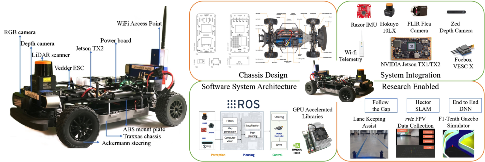

# F1/10 Autonomous Racing 
## Instructor led training 
## Nvidia GTC 2019 | University of Virginia

### What is F1/10 Autonomous Racing?

F1/10 is an international autonomous racing competition which exposes the participants to the foundations of perception, planning and control in a fun, and challenging environment. Participating teams race vehicles with similar hardware specification and try to outsmart, and outpace each other in a battle of algorithms. We’re bringing together two dozen of the top research labs and tech institutions from around the world who have built F1/10 till date.

Few things focus the mind and excite the spirit like a competition. In the early days of racing, competitors first had to build their vehicles before they could race them. It was thus as much an engineering as a racing competition. We want to rekindle that competitive spirit for autonomous systems.

### Highlights from the 3rd F1/10 Autonomous Racing Competition

## Tutorial Summary:
- F1/10 Gazebo racing simulator 
- Perception - LIDAR, and Camera - in Rviz
- Simple Navigation - Wall following and PID steering and velocity control
- Simulataneous Localization and Mapping (SLAM) using Hector SLAM
- Building and saving maps with LIDAR scan data
- Localization using the Adaptive Monte Carlo (AMCL) method
- Path planning and waypoint navigation using Time-Elastic Band (TEB) local planner. 

## F1/10 Hardware Testbed Summary
### Note: Hardware testbed is not required for this tutorial

The F1/10 platform is designed to meet the following requirements: 

1. The platform must be able to capturethe  dynamics  of  a  full  scaled  autonomous car;  
2.  Theplatform’s hardware and software stack must be modularso as to enable easy upgrades, maintenance and repairs;and 
3. The platform must be self-sustaining in terms ofpower, computation and sensors, i.e, it need not use anyexternal localization 

The testbed contains the following hardware:

* 1/10 scale rally racecar chassis with Ackerman steering from Traxxas
* Hokuyo 10LX LIDAR rangefinder
* Nvidia Jetson TX2 module
* Orbitty carrier for TX2
* ZED depth camera
* Vedder Electronic Speed Controller (VESC)
* MPU-9050inertial measurement unit (IMU)
* Ubiquiti Wifi Pico station access point

Detailed instructions on how to assemble the testbed are available on f1tenth.org
