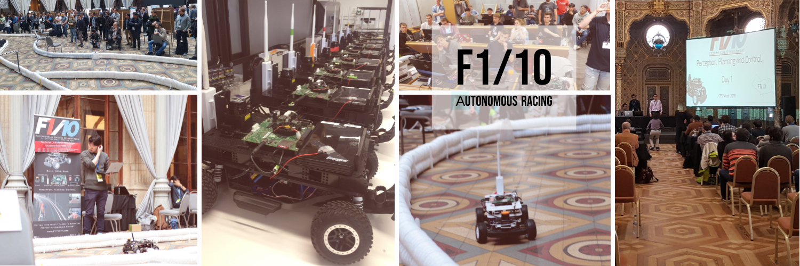

# F1/10 Autonomous Racing  
## Instructor led training
##  Nvidia GTC 2019 | University of Virginia  



### What is F1/10 Autonomous Racing?

F1/10 is an international autonomous racing competition which exposes the participants to the foundations of perception, planning and control in a fun, and challenging environment. Participating teams race vehicles with similar hardware specification and try to outsmart, and outpace each other in a battle of algorithms. We’re bringing together two dozen of the top research labs and tech institutions from around the world who have built F1/10 till date.

Few things focus the mind and excite the spirit like a competition. In the early days of racing, competitors first had to build their vehicles before they could race them. It was thus as much an engineering as a racing competition. We want to rekindle that competitive spirit for autonomous systems.

### Highlights from the 3rd F1/10 Autonomous Racing Competition

[Ctrl/Cmd + Click image below to open video in a new tab.]

[](http://www.youtube.com/watch?v=VlE2Wb_XhoQ "F1/10 Autonomous Racing Competition 2018 - Torino, Italy")

## Tutorial Summary:
- F1/10 Gazebo racing simulator
- Perception - LIDAR, and Camera - in Rviz
- Simple Navigation - Wall following and PID steering and velocity control
- Simulataneous Localization and Mapping (SLAM) using Hector SLAM
- Building and saving maps with LIDAR scan data
- Localization using the Adaptive Monte Carlo (AMCL) method
- Path planning and waypoint navigation using Time-Elastic Band (TEB) local planner.


## F1/10 Hardware Testbed Summary
### Note: Hardware testbed is not required for this tutorial


The F1/10 platform is designed to meet the following requirements:

1. The platform must be able to capture the  dynamics  of  a  full  scaled  autonomous car;  
2.  The platform's hardware and software stack must be modular so as to enable easy upgrades, maintenance and repairs and
3. The platform must be self-sustaining in terms of power, computation and sensors, i.e., it need not use any external localization

The testbed contains the following hardware:

* 1/10 scale rally racecar chassis with Ackerman steering from Traxxas
* Hokuyo 10LX LIDAR rangefinder
* Nvidia Jetson TX2 module
* Orbitty carrier for TX2
* ZED depth camera
* Vedder Electronic Speed Controller (VESC)
* MPU-9050inertial measurement unit (IMU)
* Ubiquiti Wifi Pico station access point

Detailed instructions on how to assemble the testbed are available on our [website](f1tenth.org)

## Installing

Based on the current configuration of your computer, you have three options to install the F1/10 package

### Basic options

The 'tools' folder contains scripts that help in installing the F1/10 package and all of its dependencies. You have to provide some parameters necessary to do this on your machine including

1. The name of your workspace, hereby referred to as <your_workspace_name>. This directory will be created in your machines '~/' path and will contain  all the nodes necessary to run the F1/10 package. The default value for this is 'catkin_ws'

2. The name of your preferred ROS distribution must also be supplied to the installer. This depends on the Ubuntu distribution of your machine and more information is available [here](http://wiki.ros.org/ROS/Installation).

### 1. Full install

This option installs ROS along with the dependent packages necessary to run the F1/10 package locally with full simulator support. To do this, open a terminal and execute
```console
user@computer:$ bash ./tools/install_full.sh <your_workspace_name> <your_prefered_ROS_distribution>
```

### 1. Install F1/10 package and its dependencies

This option installs the F1/10 package and the ROS navigation packages necessary to run locally on your machine. To do this, open a terminal and execute
```console
user@computer:$ bash ./tools/install_source_with_dependencies.sh <your_workspace_name> <your_prefered_ROS_distribution>
```

### 1. Install only the F1/10 package

This option installs only the F1/10 packages. Do this only if you want to experiment with algorithms that are not part of this course. To do this, open a terminal and execute
```console
user@computer:$ bash ./tools/install_source_only.sh <your_workspace_name>
```

## Getting Started

The F1/10 package complements the hardware by emulating its modular properties. The repository has been setup to help the user get started with the simulator out-of-the box. This section provides a quick dive into the three main sections of the tutorial;

The simulation sub-package contains one-line commands that perform these tasks parallelly, but we recommend that first-time users understand the processes before using these commands. If you are already experienced in ROS, the launch files are present under '/simulator/launch' directory.

### Introduction to the F1/10 simulator and basic navigation

```console
user@computer:$ roslaunch racecar_gazebo racecar.launch
```

```console
user@computer:$ roslaunch console keyboard_teleop.launch
```

### Mapping a closed environment using Hector Mapping

```console
user@computer:$ roslaunch racecar_gazebo racecar.launch
```

```console
user@computer:$ roslaunch console keyboard_teleop.launch
```

```console
user@computer:$ roslaunch platform mapping.launch
```

```console
user@computer:$ roslaunch console mapping.launch
```

```console
user@computer:$ rosrun map_server map_saver -f <name_for_your_map>
```

### Advanced navigation using the TEB local planner

```console
user@computer:$ roslaunch racecar_gazebo racecar.launch
```

```console
user@computer:$ roslaunch platform navigation.launch
```

```console
user@computer:$ roslaunch console navigation.launch
```
